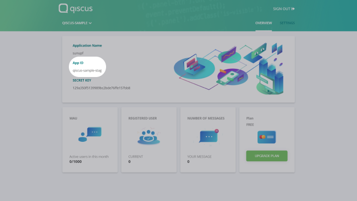
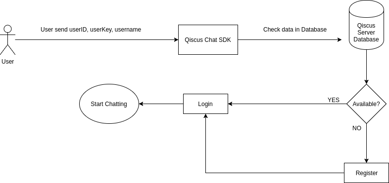
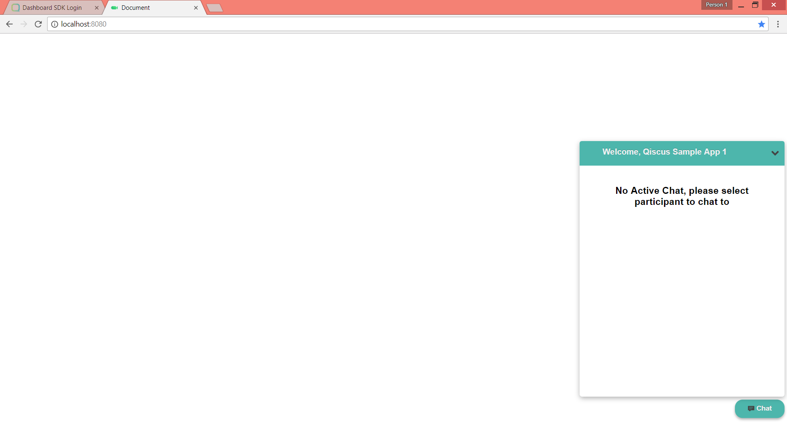

# Create Your App

In this section you will learn about:
- [Get your APP ID](link-get-your-app-id)
- [Step-by-setp building your app](link-step-by-step-building-your-app)

## Get Your APP ID

To start building app using Qiscus Chat SDK you need a key called APP ID. This
APP ID acts as identifier of your Application so that Qiscus Chat SDK can
connect your user to other users on the sample APP ID.
You can get your APP ID [here](link-get-app-id)

You can find your APP ID on your Qiscus app dashboard. Here you can see the
picture as a reference.



> All users within the same APP ID are able to communicate with each other,
> across all platforms. This means users using iOS, Android, Web clients, etc.
> can all chat with one another. However, users in different Qiscus
> applications cannot talk to each other.

## Step-by-step building your app

To build your app using Qiscus Chat SDK, here are fundamental steps to begin
with:
- [Configuration](link-configuration)
  - [Defining Container](link-defining-container)
  - [Initiating Qiscus Chat SDK](link-initiating-qiscus-chat-sdk)
- [Authentication](link-authentication)
  - [Setting User Information](link-setting-user-information)
- [Rendering Chat UI](link-rendering-chat-ui)

## Configuration

### Defining Container

Container is an element where Qiscus Web SDK Chat feature will be rendered into.
To define container you need to append `<div id="qiscus-widget"></div>` tag
before closing body tag. Here's code example.
```html
<html lang="en">
<head>
  <meta charset="utf-8">
  <title>Document</title>
</head>
<body>
  <!-- append the snippet below, before closing body tag -->
  <div id="qiscus-widget">
</body>
</html>
```
Do not forget to save your file as HTML file.
> id value "qiscus-widget" is fixed. For now you cannot change it to anything
else.

To configure Qiscus Chat SDK, you need to include `qiscus-sdk.js` to your HTML
file that you created before (see #defining container section). You can get
`qiscus-sdk.js` files from Sample App or You can directly download it
[here](link-download-qiscus-sdk-js).

### Initiating Qiscus SDK

```html
<script src="path/to/qiscus-sdk.js"></script>
```
To  initiate your chat app using Qiscus Chat SDK, you need to include the
APP ID that you got from your dashboard. Inside this init function you can more
"options" according to what your app needs. For example, here we put an Event
Handler (loginSuccessCallback) which will return information after user
successfully logged in. You can, then, do something with that information
inside the Event Handler. You can learn more about Event Handler, here, in
the next chapter.

Here is the sample code of how to initiate your APP ID and calling Event
Handler:
```javascript
QiscusSDK.core.init({
  AppId: 'YOUR_APP_ID',
  options: {
    loginSuccessCallback: function (userData) {
      // Do something you want after successfully login
    }
  }
})
```
> Please be noted that calling Event Handler is an option. not a mandatory
> thing to be included. You can still get your chat up and running without
> calling any of the Event Handler.

## Authentication

### Setting User Information

After getting your APP ID, you need to do user authentication. You can do this
easily by calling `QiscusSDK.core.setUser()` function. This function is being
used for authentication purpose, it will login the user if the User ID
already exists and the User Key match, or it will register the user
if the User ID does not exists yet and use the User Key as authentication for
the next authentication process.
```javascript
QiscusSDK.core.setUser('userId', 'userKey', 'Qiscus Demo', 'http://some-url.com/avatar.png');
```

Here is some note to understand about parameters inside setUser function:
- *userId* (string, unique): A User identifier that will be used to identify
  a user and used whenever another user need to chat with this user. It can
  be anything, wheter is is user's email, your user database index, etc.
  As long as it is unique and a string.
- *userKey* (string): uniqueKey is used as for authentication purpose, so event
  if a stranger knows your userId, he can not access the user data.
- *username* (string): Username is used as a display name inside chat room.
- *avatarURL* (string, optional): used to display user's avatar, fallback to
  default avatar if not provided.

You can learn from the figure below to understand what really happened when
calling setUser() function:


## Rendering Chat UI

Final step, you need to render chat UI by calling render function.
```javascript
QiscusSDK.render()
```

That's all. If everything is done proplerly you will get something like this


The widget chat above appear and it seems inactive. This happened because
you have not set any target to chat with. But don't worry, the step-by-step
guidance to activate Chat Rooms will be explained in the next chapter
(see [Chat Rooms section](link-chat-room-section)).

Here is the complete code.
> Complete code example (this is a placeholder)
